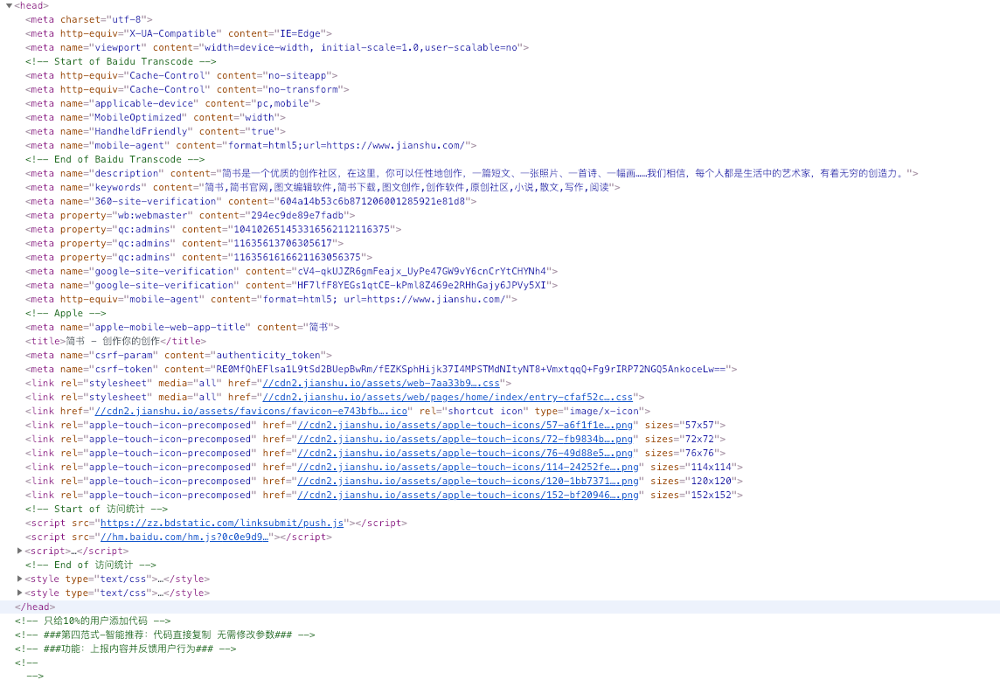
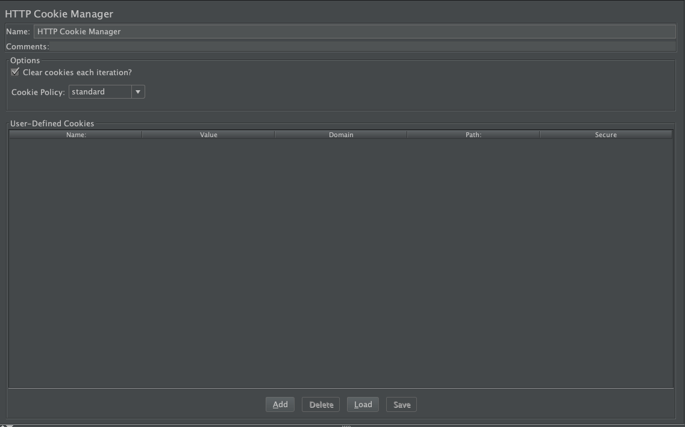

# HTTP信息头管理

用于`添加` `重写`HTTP请求的头信息。如：`User-Agent` `Accept-Encoding`

## 配制说明

- `Headers Stored in the Header Manager`: 用于配制`HTTP`请求时的头信息

  - `Name`: 头信息的`属性名`
  - `Value`: 头信息的`属性值`

- 示例代码: [HeaderManager.jmx](../src/chapter3/HeaderManager.jmx)

## 应用

以上`简书-首页`的`Request Headers`，其中的内容均可使用`HTTP Header Manager`来模拟，下面简要说明部分使用。

- 使用`User-Agent`来模拟不同的的客户端发起的请求，如: 手机端/指定浏览器版本
- 使用`Accept`来模拟文件格式
- 使用`Cookie`中的配制来模拟发送请求中的`Cookie`信息，使用`HTTP Cookie Manager`可进行较为复杂的`Cookie`管理和维护

# HTTP Cookie管理器

- 可以像浏览器一样`存储` `发送`Cookies。
- 手动管理和维护`Cookies`中的内容。

## 配制说明

- `Options`

  - `Clear cookies each iteration?`: 勾选后，每次`线程组`的循环均会清空`Cookie`，但`自定义`的不会被清空
  - `Implementation`: 选择需要继承的HC4CookieHandler(HttpClient 4.5.X API)/HC3CookieHandler(HttpClient 3 API)，可使用默认
  - `Cookie Policy`: 先找`Implementation`的具体策略，可使用默认

- `User-Defined Cookies`: 用户自定义Cookie

  - `Name`: Cookie的`属性名`
  - `Value`: Cookie的`属性值`
  - `Domain`: 作用域，对于有`作用域`要求的
  - `Path`: 域路径
  - `Secure`: 安全性，可使用默认不勾选

- 示例代码: [CookieManager.jmx](../src/chapter3/CookieManager.jmx)

## 应用

- 业务需求需要在每次执行时清空`Cookie`时，可勾选`Clear cookies each iteration?`
- 指定`Cookie`内容,可在`User-Defined Cookies`添加自定义的Cookie
