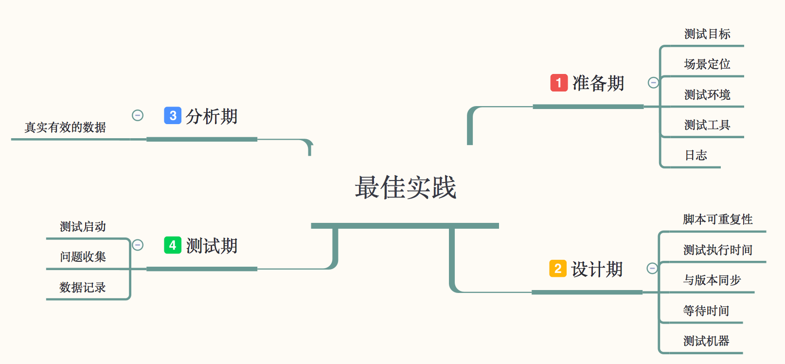

# 性能测试最佳实践

前面已经讲过[JMeter](http://jmeter.apache.org/)使用最佳实践，以下再讲讲`通用性`的性能测试最佳实践。

依据性能测试`生命周期`不同，对每个`周期`内的最佳实践进行拆分。

## 准备期

- 测试目标

  - 明确性能测试的目标: 达成的数量级/基线数量级/场景覆盖

- 场景定位

  - 定位出需要测试的场景: 分析出`需要`进行性能测试的场景有哪些，`核心`的业务场景有哪些

  - 不要假想测试场景: 不要`假想`一些可能会需要测试的场景，以免浪费测试时间

- 测试环境

  - 明确性能测试所测试的环境: 进行性能测试环境，要针对哪个环境进行。建议: 单独搭建用于性能测试的环境，配制参考`生产`环境的配制。

  - `不要`直接使用`生产`环境进行性能测试，以免给生产环境造成影响。

- 测试工具

  - 针对测试工具的选取，一定要明确`所选取`的工具的`特性`，不要盲目选择`听起来`很NB的工具

  - 测试工具，尽量选择一些`小巧/开源`，够用即可

- 日志

  - 调整日志的`输出级别`，减少日志输出对性能的影响

  - 日志中`最好`能输出对性能测试有帮助的日志

## 设计期

- 脚本可重复性

  - 性能测试脚本`最好`可`重复`执行，便于应对`不同的环境或版本更新`

- 测试执行时间

  - 测试时间: 设计测试执行时间时，一定要`适中`。强并发30分钟即可，持续操作2-3小时即可。

  - 测试周期: 条件许可的情况下，最好在每个`小`迭代版本发布的时候都`至少`进行一次。**至少** 确保在上线前进行一次

- 与版本同步

  - 性能测试所涉及的内容，一定要与版本开发的内容同步更新。

- 等待时间

  - 性能测试过程中，在业务操作过程中`也`可加入`适当`的等待时间。`等待时间`在真实的用户行为中是`肯定`存在的

- 测试机器

  - 一定不要给客户端机器过大的压力，以免客户端机器性能不足时，影响整个测试结果。

## 测试期

- 测试启动

  - 测试开始时，尽量要减少`外部`因素对`测试环境`的影响。如: 网络波动

- 问题收集

  - 及时收集问题: 在测试过程中，若发现问题时，一定要及时保存`当时`的环境信息/日志文件/测试数据

- 数据记录

  - 测试过程中，确保针对每次的测试结果有准确的记录，便于后期的结果比对。

## 分析期

- 真实有效的数据

  - 分析性能测试结果时，一定基于`真实的`测试数据。确保数据的可靠性

# 常见性能问题

以下内容，不会涉及深入的`项目内部代码`分析，仅将性能测试过程中经常出现问题的点提出来，并给出对应的参考`定位方案`。

## 客户端性能

- 客户端测试机的性能不足，影响整个性能测试结果的真实性。在测试过程中，一定要先明确`客户端`测试机的物理配制及带宽情况，确保客户端机器有`足够`的能力来执行测试。

    - 解决方案: 若客户端性能不足，建议增加客户端机器的数量。

## 服务器

### 内存泄漏

- 服务器对使用对象的**回收不及或部分对象没有回收**时，这是服务器内存泄漏的常见问题。但定位出具体哪部分有问题，还需要依据具体的项目去分析。

    - 解决方案: 输出`堆栈`信息，定位出具体的**方法或对象**问题。

### CPU较高

- CPU在测试过程中，经常会出现`居高不下或快速上升`的过程。大部分原因是由于服务端程序对CPU的计算量过大。

    - 解决方案: 尝试定位出是`哪些业务场景`引起CPU变量，再依据业务场景在`代码`中的处理方法定位出问题根源

## 数据库

### 索引

- 数据库中创建的`索引过多`，引起数据操作过慢，进而影响整个性能测试的时间。

    - 解决方案: 对性能测试场景中进行分析，找出哪些`数据操作`时长较高。优化数据库脚本

### N+1 Query

- 数据库中经常由于表设计的不合理，会引起`不必要`的多表联合查询，影响数据查询的速度

    - 解决方案：在每个表中字段的设计时，`一定`要充分考虑放在哪个表中才是`最合适`的，及是否会对业务的性能产生较大的影响

## 网络通信

- 服务器的网络数据未做`优化`时，带宽有`可能`会被消耗完全。带宽的消耗需要考虑`客户端` `服务器`两方面，每一端的带宽均会影响测试数据的准确性。

    - 解决方案: 测试过程中，需要实时查看客户端/服务器的带宽数据，确保没有达到自身的数据上限。

